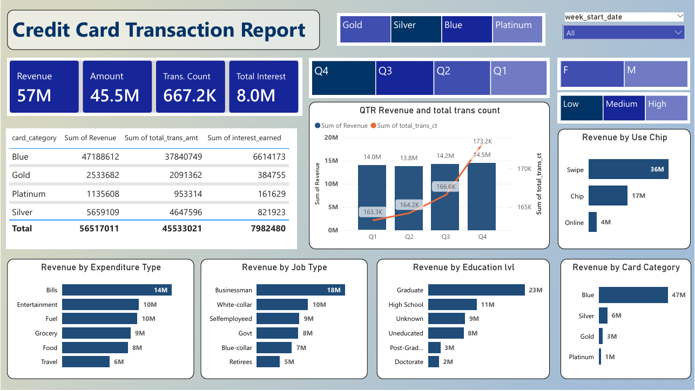
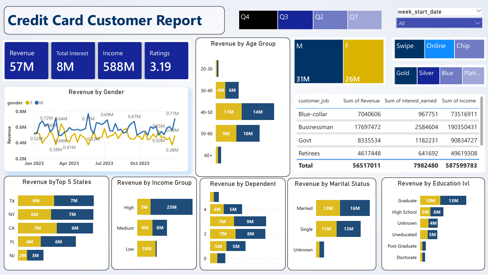

# Credit Card Transaction & Customer Analysis

## Overview
This project analyzes credit card transactions and customer demographics using
**SQL** for data storage and **Power BI** for visualization and insights.

## Tech Stack
- PostgreSQL / MySQL
- SQL
- Power BI
- Power Query & DAX

## Project Flow
1. Created `cc_db` database and tables using SQL  
2. Imported transaction and customer CSV data  
3. Cleaned and transformed data using Power Query  
4. Created DAX measures for KPIs  
5. Designed interactive Power BI dashboards  

## Key Dashboards
### Credit Card Transaction Report

### Credit Card Customer Report

## High-Level Insights
- Blue card category contributes the highest revenue (~47M)
- Swipe transactions dominate over chip and online
- Businessman and Graduate segments generate the highest revenue
- Q4 shows peak revenue and transaction count

## Note
Full datasets are not included due to data privacy.
